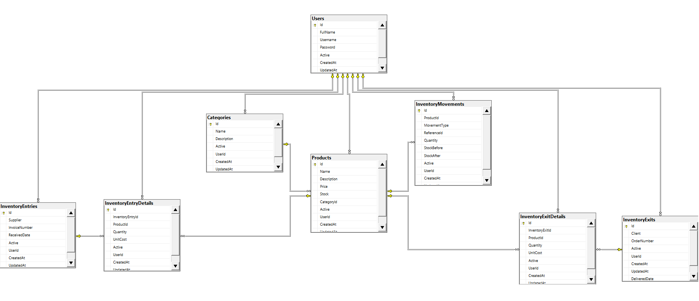

# Inventory Management API

## Description

Inventory Management API is a REST API developed using **Microsoft technologies** for managing an inventory module.

The solution is designed following a layered architecture and built with the following technologies:

* ASP.NET Core Web API
* Entity Framework Core (For Queries)
* Dapper (For Transactions)
* SQL Server 2022
* JWT Bearer Authentication
* Docker / Docker Compose
* xUnit for unit testing

---

# Architecture

The solution contains the following projects:

```text
Inventory.Api
Inventory.Application
Inventory.Domain
Inventory.Infrastructure
Inventory.Tests
```

**Project Responsibilities**

| Project                  | Description                                                    |
| ------------------------ | -------------------------------------------------------------- |
| Inventory.Api	           | REST endpoints and application configuration                   |
| Inventory.Application	   | DTOs, services, and interfaces                                 |
| Inventory.Domain	       | Domain entities                                                |
| Inventory.Infrastructure | Entity Framework, Dapper, repositories, SQL Server, JWT        |
| Inventory.Tests	       | Unit tests                                                     |

---

# Implemented Technologies

* .NET 10
* ASP.NET Core Web API
* Entity Framework Core
* Dapper
* SQL Server 2022
* JWT Bearer Authentication
* Docker / Docker Compose
* xUnit
* Swagger / OpenAPI

---

# Requirements

To run the project locally, the following tools are required:

* Visual Studio 2022 (Community) or higher
* .NET SDK 10
* SQL Server 2022
* Docker Desktop (optional)
* Git

---

# Clone the Project
```bash
git clone https://github.com/josej037/RedArbor.Inventory.git
```

# Configuration

The application uses the following connection string:
```json
{
  "ConnectionStrings": {
    "InventoryDb": "Server=localhost;Database=InventoryDb;User Id=sa;Password=Inventory@2026;TrustServerCertificate=True;"
  }
}
```

It can also be configured using environment variables:
```text
ConnectionStrings__InventoryDb=Server=localhost;Database=InventoryDb;User Id=sa;Password=Inventory@2026;TrustServerCertificate=True;

Jwt__Key=RedArborInventoryTest202607SspTgaFsvpcK98765
Jwt__Issuer=Inventory.Api
Jwt__Audience=Inventory.Api
Jwt__ExpirationMinutes=60
```

---

# Running the Application Locally

Restore dependencies:
```bash
dotnet restore
```

Build the solution:
```bash
dotnet build
```

Run the application:
```bash
dotnet run --project Inventory.Api
```

The API will be available at:
```text
http://localhost:8080
```

Swagger documentation will also be available from this URL.

---

# Database

When the application starts:

* Pending migrations are automatically executed.
* Initial demo data is loaded.

## Migrations (Optional)
```bash
dotnet ef migrations add InitialCreate --project Inventory.Infrastructure --startup-project Inventory.Api
```

## Apply migrations (Optional)
```bash
dotnet ef database update --project Inventory.Infrastructure --startup-project Inventory.Api
```

## Database Diagram

The following diagram shows the database schema used by the application.

<p align="center">
  
</p>

---

# Initial Data

The application automatically creates an administrator user.

| Username	| Password   |
| -------   | ---------- |
| admin	    | Admin123*  |

The following demo data is also created:

* Categories
* Products

---

# Authentication

The API uses JWT Bearer authentication.

## Login

To obtain an authentication token:
```http
POST /api/Auth
```

Request body:
```json
{
    "username":"admin",
    "password":"Admin123*"
}
```

The response will return a string containing the JWT token.

---

## Using the Token

In Swagger:

1. Click Authorize
2. Paste the JWT token
3. Confirm by clicking Authorize

After authentication, protected endpoints can be executed.

---

# Running with Docker

* Start the application:
```bash
docker compose up --build
```

* Stop the application:
```bash
docker compose down
```

* Remove the SQL Server volume:
```bash
docker compose down -v
```

The application will be available at:
```text
http://localhost:8080
```

---

# Running Unit Tests

Execute the test project to verify the application service behavior:
```bash
dotnet test Inventory.Tests/Inventory.Tests.csproj
```

---

# Debugging in Visual Studio
1. Open the solution.
2. Set **Inventory.Api** as the startup project.
3. Verify that SQL Server is available (local instance or Docker).
4. Press **F5**.
5. The application will execute migrations and load demo data.
6. Swagger will open to test the API services.

---

# Main Endpoints

## Authentication
* POST /api/Auth

## Categories
* GET /api/Category
* GET /api/Category/{id}
* POST /api/Category
* PUT /api/Category/{id}
* DELETE /api/Category/{id}

## Products
* GET /api/Product
* GET /api/Product/{id}
* POST /api/Product
* PUT /api/Product/{id}
* DELETE /api/Product/{id}

## Inventory Entries
* GET /api/InventoryEntry
* GET /api/InventoryEntry/{id}
* POST /api/InventoryEntry
* PUT /api/InventoryEntry/{id}
* DELETE /api/InventoryEntry/{id}

## Inventory Exits
* GET /api/InventoryExit
* GET /api/InventoryExit/{id}
* POST /api/InventoryExit
* PUT /api/InventoryExit/{id}
* DELETE /api/InventoryExit/{id}

---

# Decision Making
1. Describe a recent technical decision you made with incomplete information. What was missing and how did you decide to move forward?
```text
During the API authentication analysis, I had to evaluate whether to use an external authorization service or implement JWT Bearer authentication directly.
The missing information was which identity providers were allowed for authorization and whether an independent authorization server would be available.
I decided to move forward with JWT Bearer because it provided the required security features for the project and allowed future scalability if required.
```

2. When two technical approaches seem equally valid, what criteria do you use to choose one?
```text
In these cases, I evaluate the characteristics offered by each option and validate that they are:
- Easy to implement
- Easy to maintain
- Scalable
- Compliant with security requirements

In this project, two approaches for data persistence were evaluated: Entity Framework Core and Dapper.

Entity Framework Core was selected for query operations and Dapper for transaction operations because EF Core provides better driven when working with entities, while Dapper provides control over execution for write operations.
```

3. Describe a case where you had to reverse or change one of your own technical decisions. What did you learn from that experience?
```text
One technical decision that I have had to reconsider in some projects is over-engineering the architecture design.

I always aim to apply good design principles and architectural patterns, but sometimes these approaches do not provide enough value for the project and can make the solution more complex than necessary.

Through experience, I have learned to better evaluate the complexity of the requirements and apply design principles according to the real needs of the project.
```

---

# Author

Technical Test - Candidate: jose